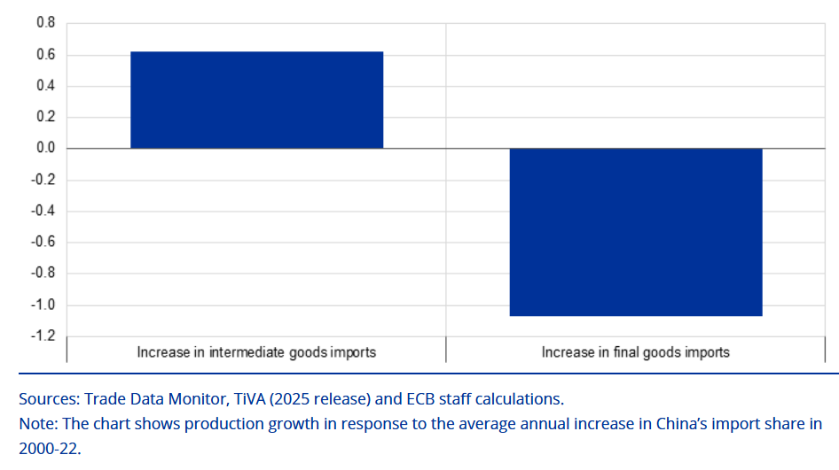

**Outlet.** ECB Economic Bulletin, Issue 3 / 2026, Box 2.

**Summary.** This box examines how the rise in China's import share between 2000 and 2022 has affected euro area production growth, distinguishing between intermediate and final goods imports. The chart shows that increases in intermediate goods imports from China are associated with positive production growth, while increases in final goods imports are associated with negative production growth.

*Sources: Trade Data Monitor, TiVA (2025 release) and ECB staff calculations.*

[Read the full box](https://www.ecb.europa.eu/press/economic-bulletin/focus/2026/html/ecb.ebbox202603_02~7df7facd9a.en.html)

[Citation (RePEc)](https://ideas.repec.org/a/ecb/ecbbox/202600032.html)
